# 🖥️ AWS 3-Tier Web App Lab

This project demonstrates a classic 3-tier architecture on AWS using EC2, RDS, and Apache. The walkthrough includes full CLI configuration, MySQL database creation, and custom webpage deployment — all documented with real output and screenshots.

---

## 🧱 Architecture Overview

- **Frontend**: EC2 running Apache HTTPD  
- **Backend**: MySQL 8 on Amazon RDS  
- **Storage (optional)**: S3 static hosting  
- **Security**: SSH key access and Security Groups  
- **Tools Used**: CLI, `yum`, MySQL client, `nano`, `bash`

---

## 📁 Folder Structure

```
aws-3tier-webapp-lab/
├── app/
│   └── index.html
├── assets/
│   └── users.sql
├── docs/
│   ├── ec2-setup-guide.md
│   ├── rds-connection-guide.md
│   ├── load-balancer-setup.md
│   └── s3-static-hosting.md
├── screenshots/
│   └── *.png (all referenced images)
└── README.md
```

---

## ✅ Setup & Screenshots

### 1️⃣ Project Initialization

Created folder structure and initialized GitHub repo.

📸 Initial folder structure  
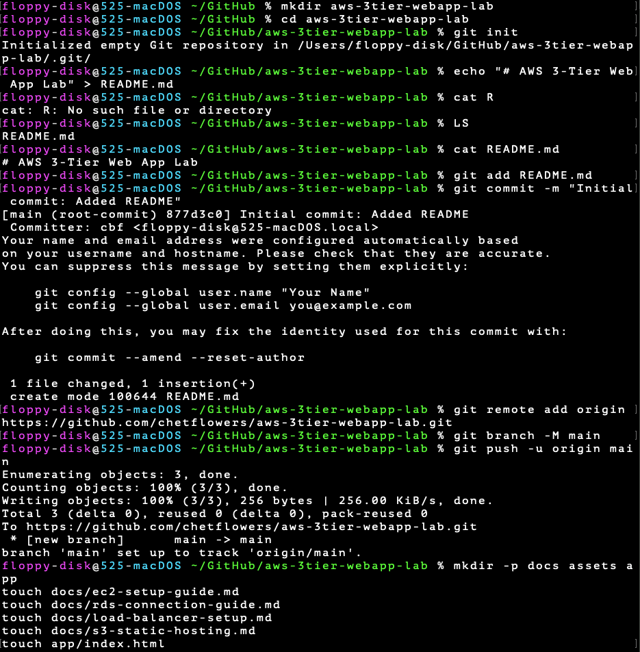  
📸 GitHub repo  
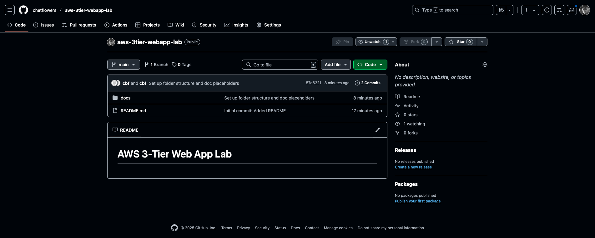

---

### 2️⃣ Create RDS Instance and Configure

RDS created via AWS Console.  
Security Group updated to allow EC2 access on port 3306.

📸 RDS created  
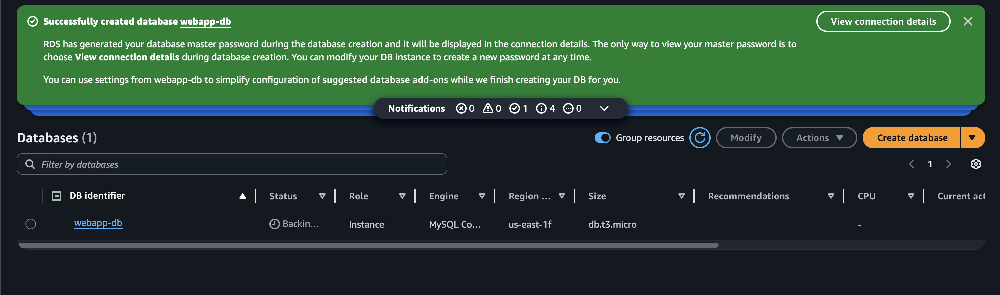  
📸 RDS summary  
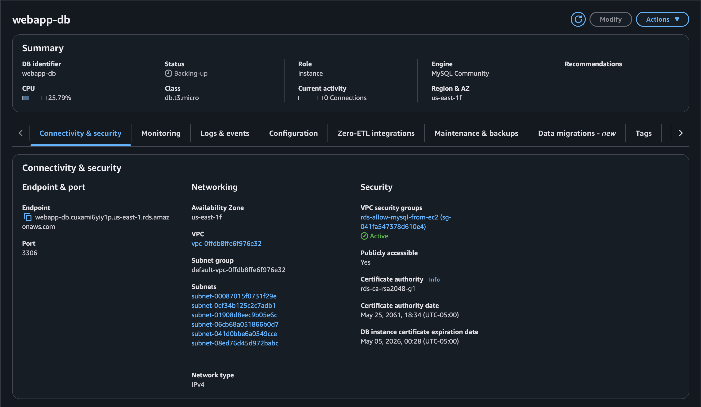  
📸 Inbound SG rules  
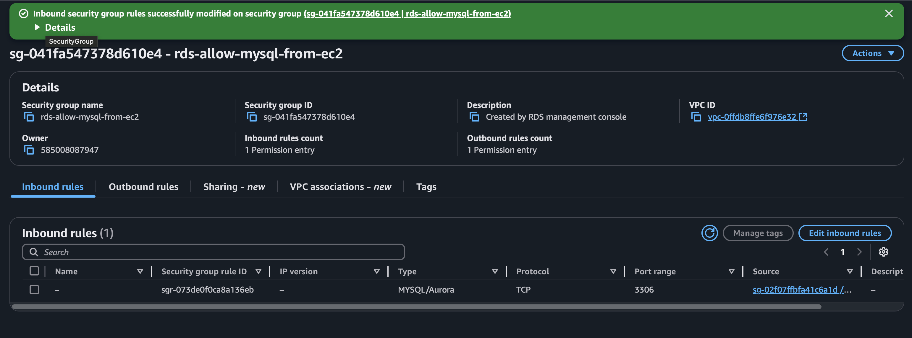

---

### 3️⃣ Launch EC2 and SSH In

Connected via `.pem` key from macOS terminal.

📸 EC2 summary  
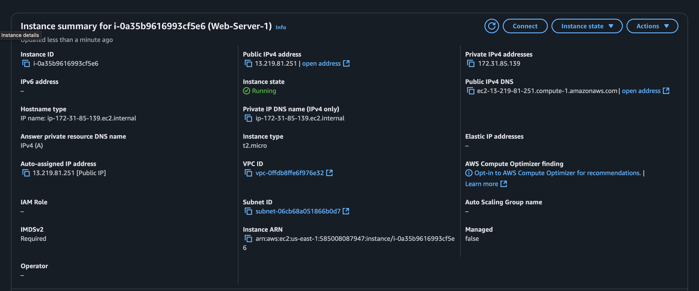  
📸 EC2 dashboard  
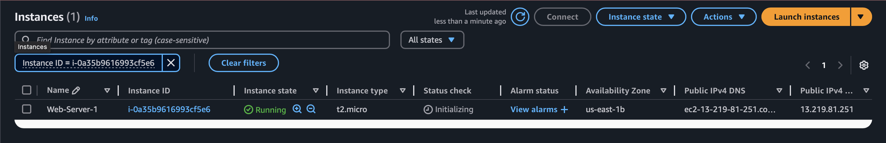  
📸 SSH key permissions  
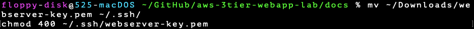  
📸 SSH from macOS  
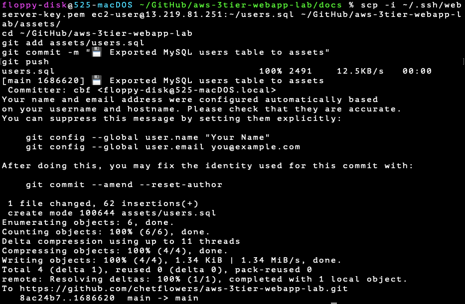  
📸 SSH confirmation  
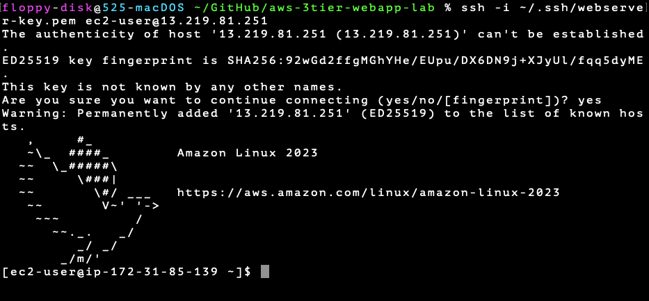  
📸 whoami + yum update  
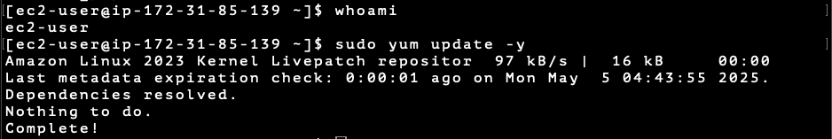

---

### 4️⃣ Install Apache Web Server

```bash
sudo yum install -y httpd
sudo systemctl start httpd
sudo systemctl enable httpd
```

📸 Install started  
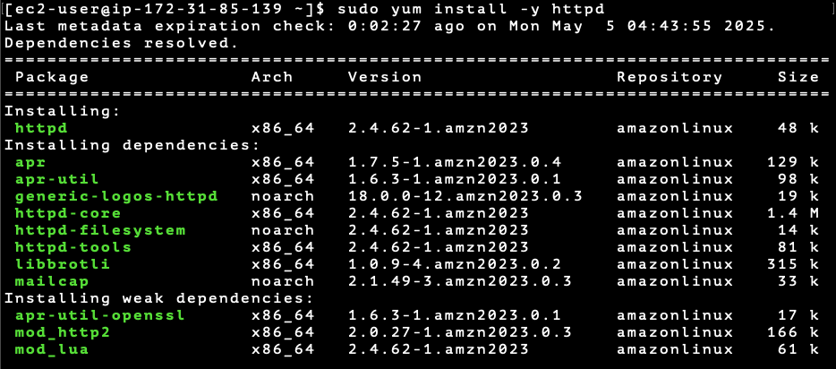  
📸 Install complete  
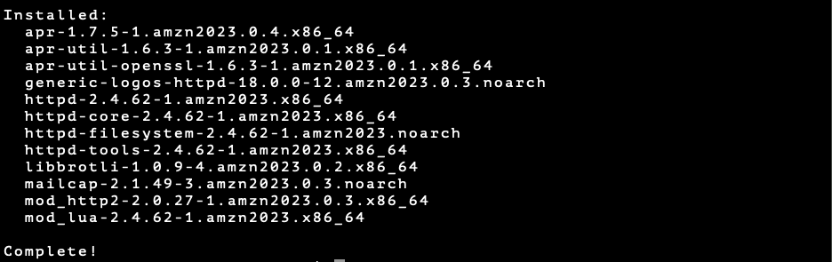  
📸 Service enabled  


---

### 5️⃣ Serve a Web Page

```bash
echo "<h1>Hello from Chet's EC2 Web Server!</h1>" | sudo tee /var/www/html/index.html
```

📸 Broken echo command  
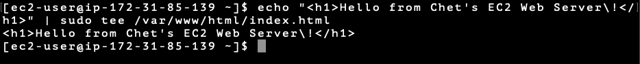  
📸 Fixed echo command  
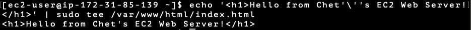  
📸 Apache default page  
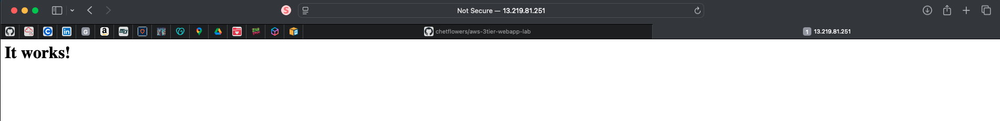  
📸 Custom EC2 HTML served  
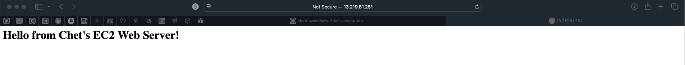

---

### 6️⃣ Install MySQL Client on EC2

```bash
sudo yum install -y https://dev.mysql.com/get/mysql80-community-release-el9-1.noarch.rpm
sudo rpm --import https://repo.mysql.com/RPM-GPG-KEY-mysql-2022
sudo yum install -y mysql-community-client
```

📸 Install repo  
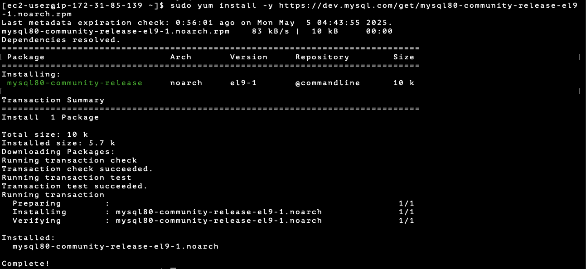  
📸 Import GPG  
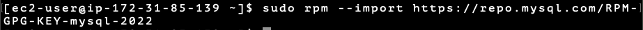  
📸 Install client  
  
📸 Client install failed  


If install fails:

```bash
sudo yum clean packages
sudo yum clean metadata
sudo yum makecache
sudo yum install -y mysql-community-client --nogpgcheck
```

📸 Cleaned metadata  
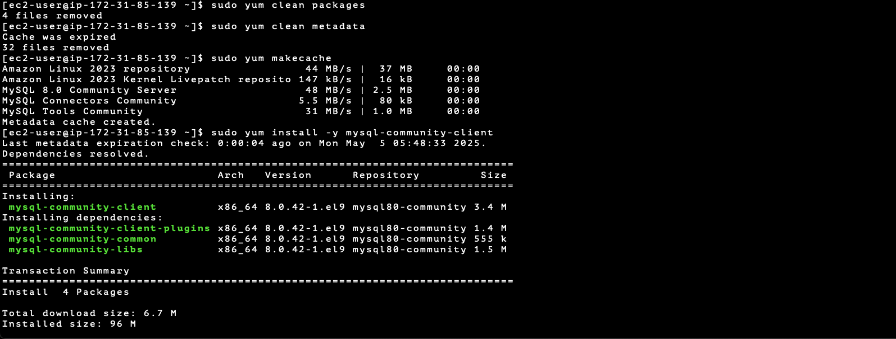  
📸 Final install success  
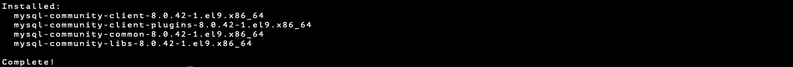

---

### 7️⃣ Connect to RDS from EC2

```bash
mysql -h webapp-db.cuxami6yiy1p.us-east-1.rds.amazonaws.com -u admin -p
```

📸 Login successful  
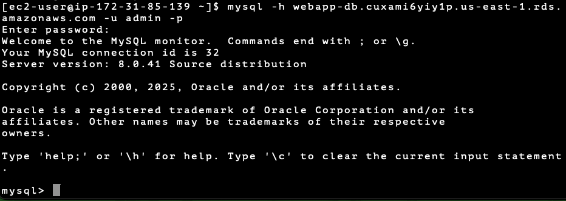

---

### 8️⃣ Create Database and Table

```sql
CREATE DATABASE webapp;
USE webapp;

CREATE TABLE users (
  id INT AUTO_INCREMENT PRIMARY KEY,
  username VARCHAR(50),
  email VARCHAR(100),
  created_at TIMESTAMP DEFAULT CURRENT_TIMESTAMP
);

INSERT INTO users (username, email) VALUES
('chet', 'chet@example.com'),
('admin', 'admin@example.com'),
('Alice Smith', 'alice@example.com'),
('Bob Jones', 'bob@example.com');

SELECT * FROM users;
DESCRIBE users;
```

📸 Created DB and inserted users  
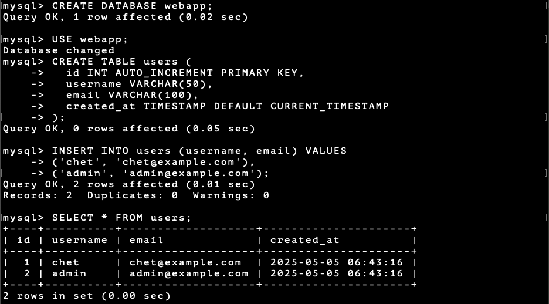  
📸 Selected and described users  
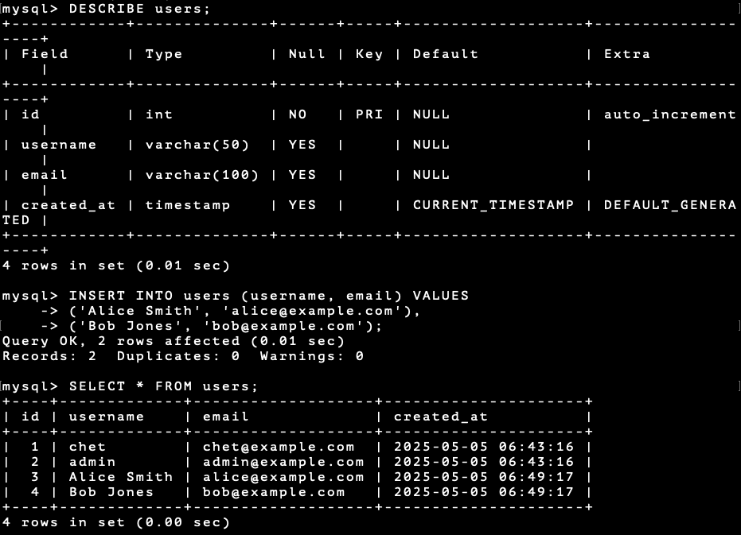

---

### 9️⃣ Export Table (Optional)

```bash
mysqldump -h webapp-db.cuxami6yiy1p.us-east-1.rds.amazonaws.com -u admin -p webapp users > users.sql
```

📸 Exported via mysqldump  
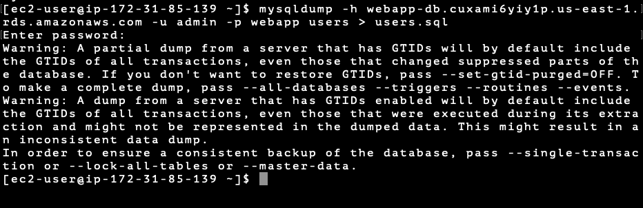  
💾 File saved to `/assets/users.sql`

---

## 📸 Screenshot Summary

All screenshots are stored under `/assets/`, named according to the step.

---

## 🧾 Lessons Learned

- Security Groups must allow specific port access between EC2 and RDS
- Amazon Linux 2023 requires special handling for MySQL GPG key verification
- Echoing HTML in bash needs careful escaping (`!`, `'`, `"`)
- Documenting every step with screenshots makes troubleshooting and handoff easier

---

## 🧠 Interview Tip

> "This lab shows I can configure full-stack infrastructure on AWS — EC2 frontend, RDS backend, and Apache + MySQL integration — while solving CLI issues and documenting the full flow."

---

## 📚 Related Documentation

- `docs/rds-connection-guide.md`
- `docs/ec2-setup-guide.md`
- `docs/load-balancer-setup.md`
- `docs/s3-static-hosting.md`
